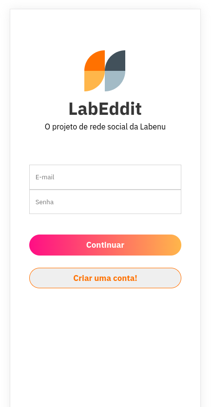
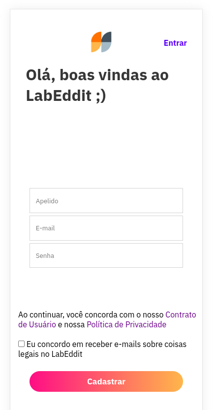
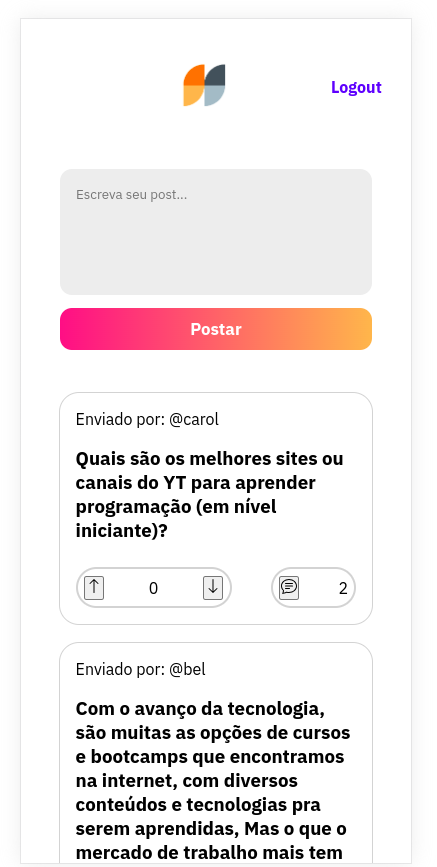
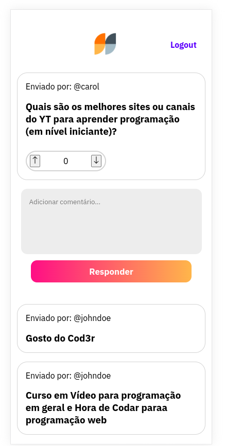

# Labeddit - Front-end

Este é o repositório front-end do projeto fullstack LabEddit. É um projeto mobile first de uma rede social no estilo Reddit, criado no bootcamp da Labenu.
Link para o repositório back-end: https://github.com/carolcampos22/labeddit-backend

## Tecnologias utilizadas
 - React.js
 - Styled-components

## Instalação
Clone o repositório:
 ```bash
 git clone https://github.com/carolcampos22/labeddit-frontend
 ```

Acesse o repositório do projeto: 
```bash
cd labeddit-frontend

```

Instale as dependências:
```bash
#com npm:
npm install

#ou com Yarn:
yarn install
```

Inicie o servidor:
```bash
#com npm:
npm run start

#ou com yarn:
yarn start
```

## Site 
https://labeddit-frontend-delta.vercel.app

## Layout

1. Página de login:



2. Página de cadastro:



3. Página de posts:



4. Página de comentários:



## Próximos passoa
- Responsividade nas páginas de posts e de comentários
- Adicionar header
- Adicionar botões para facilitar a navegação entre as páginas
- Melhorias na estilização

## Autora

#### Carolina Mendes - Web developer
[](https://www.linkedin.com/in/dev-carolina-mendes/)
